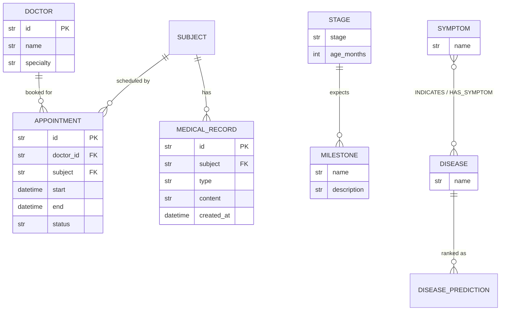

# Data Model

The domain entities, defined once in `app/schemas.py` (Pydantic 2) and mirrored
in `web/lib/api.ts`. The point: **the model is FHIR-aware on purpose** — records
key off a `subject` reference now so that a real FHIR/EHR mapping later is a
relabelling, not a rewrite.

Two stores back this model today, both with zero-infra fallbacks:
clinical data in an **in-memory repository**, the symptom→disease graph
**in-memory from CSV** (Neo4j optional). Both have a planned persistence path.

## Entities

### Intelligence (symptom checker + graph)

| Entity | Field | Type | Notes |
|--------|-------|------|-------|
| **SymptomRequest** | `symptoms` | `list[str]` | Required |
| | `age_months` | `int \| None` | Optional |
| | `explain` | `bool \| None` | Request LLM explanation |
| **DiseasePrediction** | `disease` | `str` | |
| | `confidence` | `float` | Weighted symptom-overlap score |
| | `matched_symptoms` | `list[str]` | Evidence — why this ranked |
| **PredictResponse** | `predictions` | `list[DiseasePrediction]` | Ranked |
| | `triage` | `str` enum | `self-care` \| `see-doctor` \| `urgent` |
| | `explanation` | `str` | Provider-dependent |
| | `disclaimer` | `str` | Always present |
| **RelatedNode** | `name` / `relation` / `weight` | `str` / `str` / `float` | Graph edge |
| **GraphResponse** | `node` / `related` | `str` / `list[RelatedNode]` | |

### Clinical (doctors, appointments, records, stages)

| Entity | Field | Type | Notes |
|--------|-------|------|-------|
| **Doctor** | `id` | `str` | |
| | `name` / `specialty` | `str` | |
| **Appointment** | `id` | `str` | Server-assigned |
| | `doctor_id` | `str` | FK → Doctor |
| | `subject` | `str` | FHIR-style patient ref (e.g. `patient/123`) |
| | `start` / `end` | `datetime` | Overlap → 409 |
| | `status` | `str` enum | e.g. `booked` \| `cancelled` \| `completed` |
| **MedicalRecord** | `id` | `str` | Server-assigned |
| | `subject` | `str` | **FHIR-style** ref — keys all records |
| | `type` | `str` | e.g. `note`, `observation` |
| | `content` | `str` | |
| | `created_at` | `datetime` | |
| **Milestone** | `name` | `str` | Expected developmental milestone |
| | `description` | `str` | |
| **StageResponse** | `stage` | `str` | Growth stage label for age |
| | `age_months` | `int` | |
| | `milestones` | `list[Milestone]` | |
| **Role** (enum) | — | `str` | RBAC roles (e.g. `parent`, `doctor`, `admin`) — for planned auth |

> Exact field names/optionality live in `app/schemas.py` — treat that as
> authoritative if this table drifts.

## Relationships (ER)

`SUBJECT` is not a stored table today — it's a **FHIR-style reference string**
(`patient/{id}`) used as the foreign key on appointments and records. It becomes
a real `Patient` entity when the EHR/FHIR mapping lands.

## FHIR mapping notes

| Our model | FHIR resource | Notes |
|-----------|---------------|-------|
| `subject` reference | `Reference(Patient)` | Same shape (`ResourceType/id`); deliberate |
| `MedicalRecord` | `Observation` / `DocumentReference` | `type` selects the FHIR resource |
| `Appointment` | `Appointment` | `status` maps to FHIR appointment status codes |
| `Doctor` | `Practitioner` | `specialty` → `qualification`/`PractitionerRole` |
| `StageResponse` / `Milestone` | (no direct FHIR resource) | Domain-specific; could map to `Observation` (developmental) |

We do **not** claim FHIR conformance — the model is *FHIR-shaped* so a future
mapping is incremental.

## Persistence roadmap (planned)

| Data | Now | Planned | Trigger |
|------|-----|---------|---------|
| Clinical (doctors, appointments, records, stages) | In-memory repository | SQLite → Postgres via `DATABASE_URL` | Real (non-synthetic) data, multi-process, durability |
| Knowledge graph | In-memory from `data/symptom_disease.csv` | Neo4j via `NEO4J_URI` (already env-switchable) | Larger graph, graph queries beyond overlap |

Migration principles (see [definition-of-done.md](definition-of-done.md) Heavy tier):
the repository interface stays stable so swapping the store doesn't touch
services; migrations must be reversible; **no real PHI** lands before encryption,
audit log, retention, and RBAC (`Role` enum) move from stub to implemented in
`app/security.py`.
